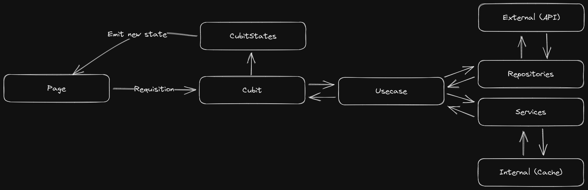

# Architecture

The chosen architecture used is based on clean-architecture, trying to avoid over-engineering.

The idea is to have one flow only avoiding cyclical flows on the behavior.

## Datasource removed?

Starting from the idea that we have a completely "own" database in our system and in order to avoid over-engineering, the Datasource, the outermost layers, was discarded.

In my point of view, this extra layer is essential if we are using some BaaS (Backend as a service), like Firebase/Supabase.

### Cubit/Controller

Will handle only our UI states and nothing more than that.

### Usecases

Will handle only our Logic and validate when necessary.

### Repositories

In that case, will handle our external calls to the API and the necessary validations for the API Response.

### Services

In our scenarion, we are using to handle only our cache logic.
