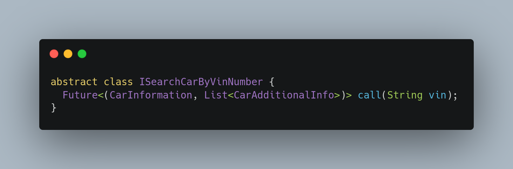

# Features dart

As commented in the initial documentation, it was decided to use the new features of the language in order to avoid coupling in packages, in my view there is no need for the extra coupling.

**Records** as **dartz/fpdart** for **Left/Right** on that case.

https://dart.dev/language/records

**Sealed Class** to force the developer to keep the errors in the correct place and create architectural limits.

https://dart.dev/language/class-modifiers#sealed
