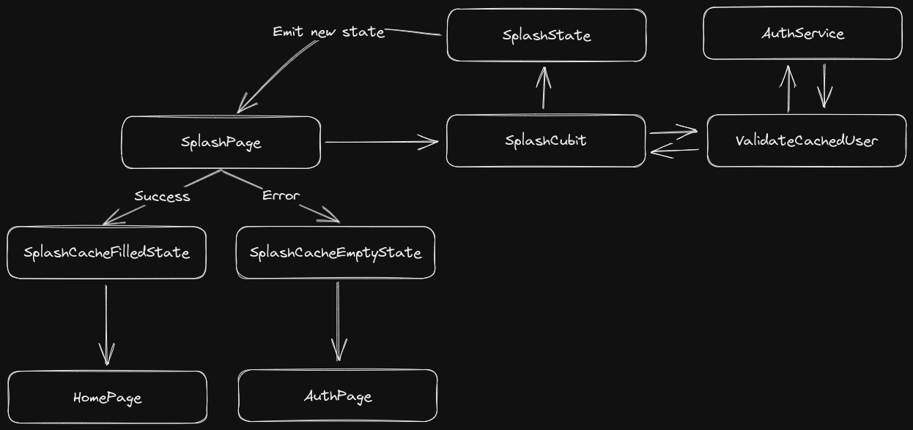
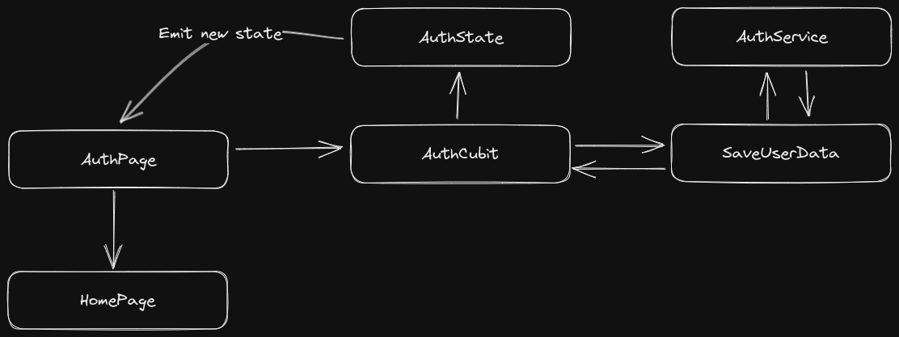
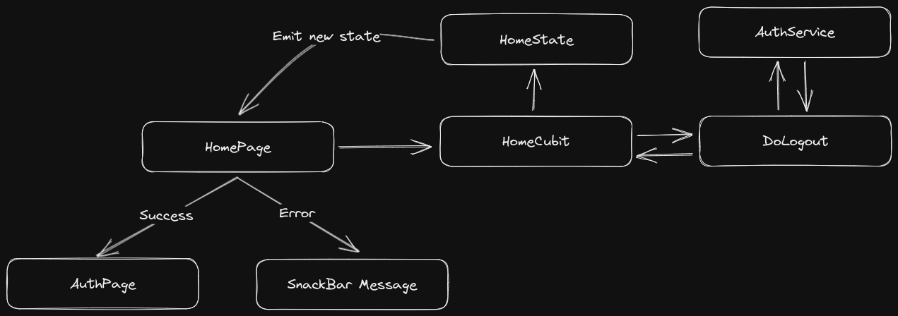
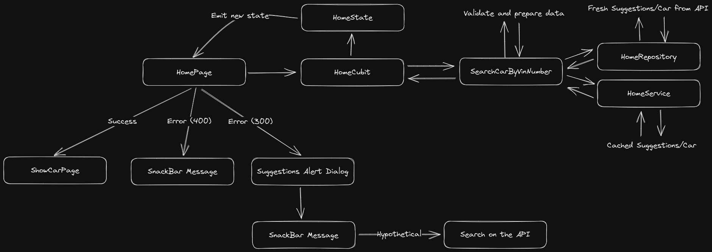

# Flow

In all flows, I tried to keep the idea of ​​a single flow, without additional turns.

## SplashPage

When the user opens the App for the first time, and nothing is cached the code will throw an Exception and move the user to the `HomePage`.

The `AuthService` located in the `Core` is responsible to the cache informations about the `User`, `Session`.

## Login

The `Name` and `Email` will be validate in the Flutter `UI` and in the `Usecase` to to ensure consistency. After that user will be pushe to `HomePage`

## HomePage

### Logout

User will tap the button to logout located at the top right and if got a success will be moved to the `AutPage`.

### Search VIN code

The `VIN Code` will be validate on the `UI` and `Usecase`, to ensure the consistency. In that scenarie depending on the response from the API we get/save the cached information and return to the user.

