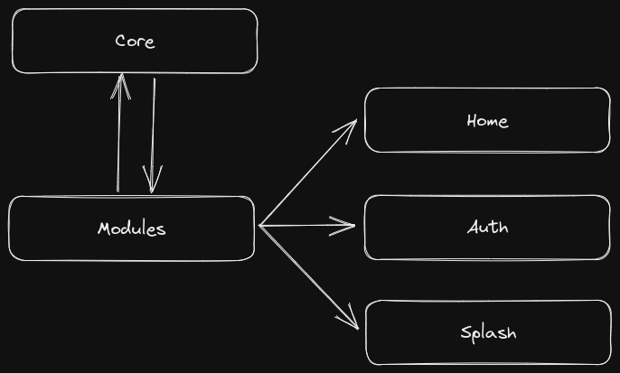

# Modules

The idea of use a more modular approach is to keep easy to understand, separate the objectives.

## I can meet any of them

The core can share any information, usecase with different modules, this works for everything.

## I only know myself

In that case, each module needs to know about itself, one example is the usecase `SaveUserData`, the only moment we save the user date is when we do the login flow inside the `AuthPage`. The only one who knows about the `SaveUserData` is the `AuthModule`.
