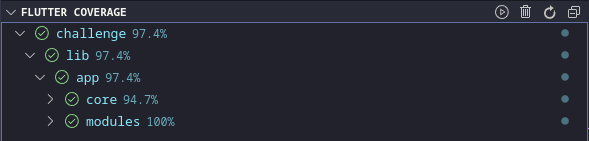

# What to test?

It was decided to test most things, taking out the State classes, why? Because they didn't have much to test.

## Unit tests & Coverage

The coverage for the unit tests was expected, more than 70%, without the `CosChallenge` of course.

The coverage is related only to the unit tests.

## Integration tests

I focused to test the function of each page like `SplashPage`, `AuthPage`, `HomePage`, `ShowCarPage`. In that case I tested the visual, the correct and wrong behavior related to each one.
